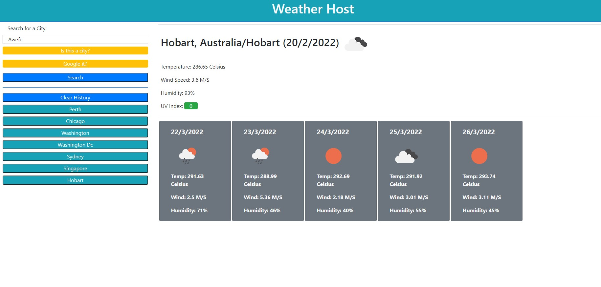

# Installation 

```
git init
git remote add origin main
git branch -M main
git pull
```

# credits

[Origin 42](https://github.com/origin-42)

[Dave Plummer](https://origin-42.github.io/Dave-Plummer-Portfolio/) - Dave Plummer Portfolio Website

[Regular Expressions](https://stackoverflow.com/questions/34974942/regex-for-no-whitespace-at-the-beginning-and-end)

## Extras

[Home Screen](https://origin-42.github.io/weather_host/) - Weather Host


