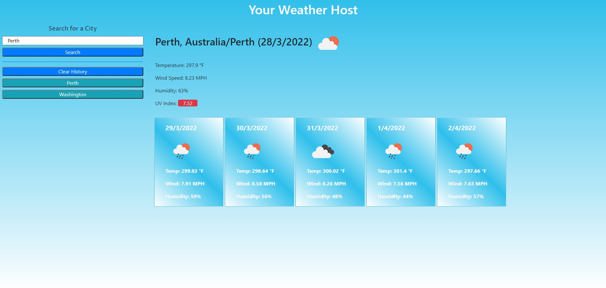

Here is an application to check cities on the globe for weather conditions. Helpful for those travelling, scouting, or just planning a trip to the beach, don't forget your sunscreen!

Data includes temperature, wind speed, humidity and UV displaying whether it is favourable or not. From here, information on the later three is displayed in a 5 day forecast from the search date. No need to remember your input, with the search history, you may easily update yourself on a previous search.

Further implementation may include a dropdown for more detailed weather information or weather information throughout the day. Perhaps comparisons between days or cities.

# Installation 

```
git init
git remote add origin main
git branch -M main
git pull
```

# credits

[Origin 42](https://github.com/origin-42)

[Dave Plummer](https://origin-42.github.io/Dave-Plummer-Portfolio/) - Dave Plummer Portfolio Website

[Regular Expressions](https://stackoverflow.com/questions/34974942/regex-for-no-whitespace-at-the-beginning-and-end)

## Extras

[Home Screen](https://origin-42.github.io/weather_host/) - Weather Host


